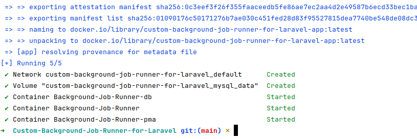
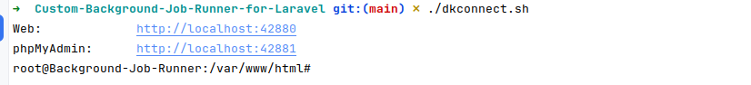
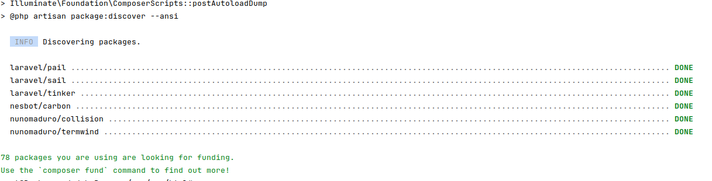
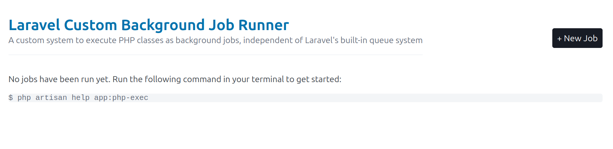
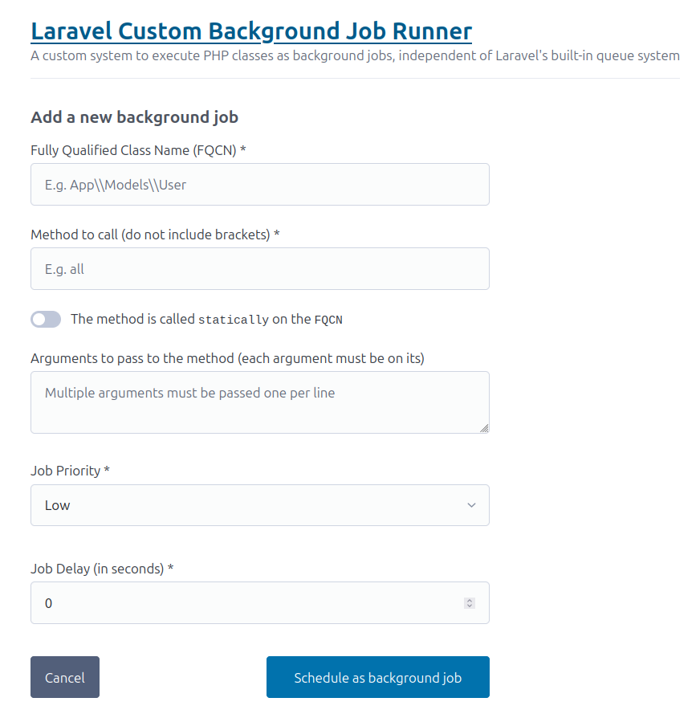
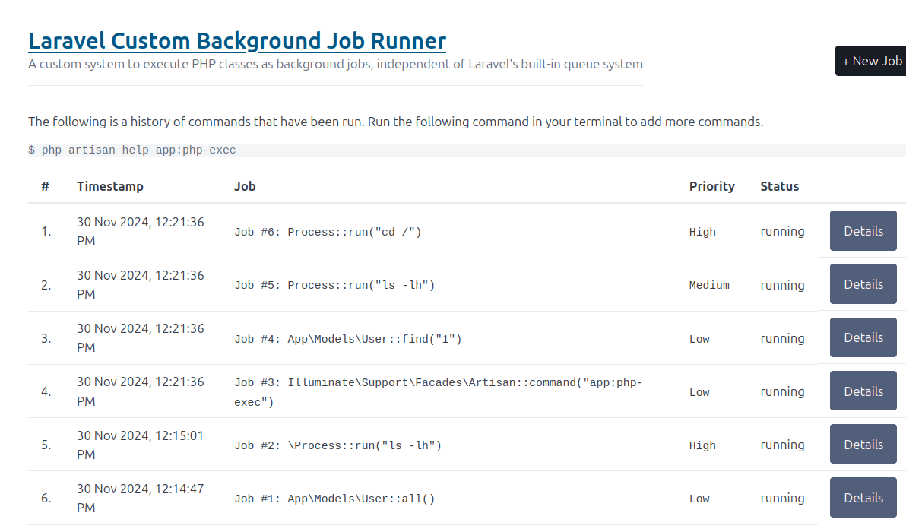
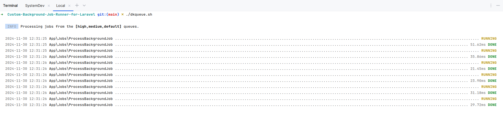
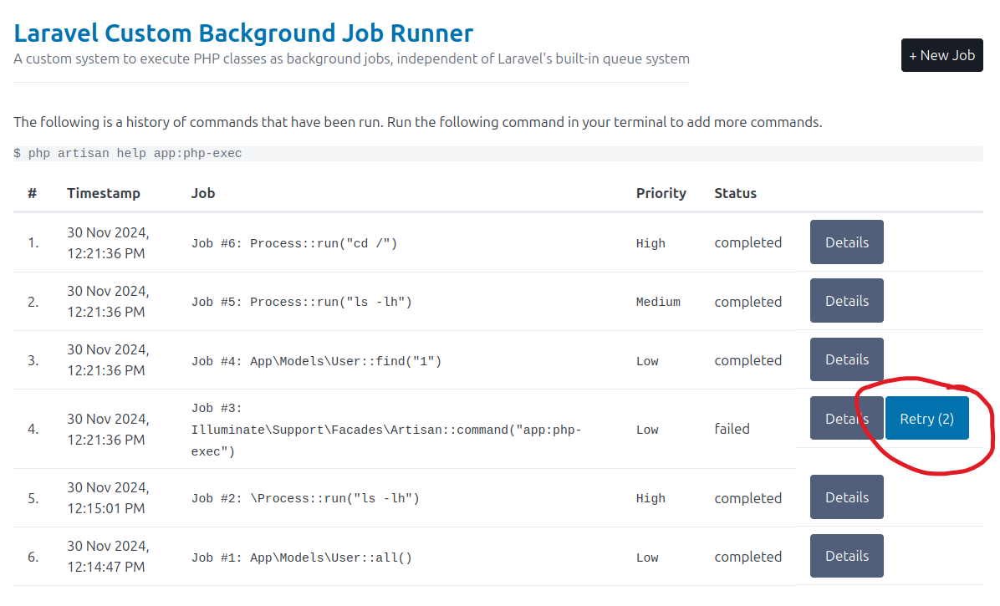

# Laravel Custom Background Job Runner

A custom system to execute PHP classes as background jobs, independent of Laravel's built-in queue system

## Requirements

- [Docker Desktop](https://www.docker.com/products/docker-desktop/). Please make sure that you install the right version
  for your operating system. Docker Desktop runs smoothly on Windows, macOS and Linux.

## Installation

- Clone the repository somewhere on you machine and navigate to it.

```shell
git clone
https://github.com/gmurambadoro/Custom-Background-Job-Runner-for-Laravel.git
cd Custom-Background-Job-Runner-for-Laravel
```

- When inside the folder of the repository, run the `./dkbuild.sh` for Linux/macOS or `./dkbuild.bat` for Windows. This
  command will build the docker containers required by the application.



- Now log into the main application container using `./dkconnect.sh`. If you are on Windows, then use `./dkconnect.bat`.



- Now install Laravel and its `composer` packages.

`composer install`



- Create the `.env` file, generate the `keypair` and run some migrations. You might need to fix some file permissions as
  well.

```shell
cp .env.example .env
php artisan key:generate
php artisan migrate
chmod -R 0777 storage/
```

🎉 Now the application is now ready at the following endpoints:

- [Website URL](http://localhost:42880)
- [phpMyAdmin for the Database](http://localhost:42881)



## How-to Guides

### Add some background Jobs

#### 1. Using the web form

You can add some jobs from the application by clicking on the `+ New Job` button.



Complete the form and save your changes. A new job will be created.

#### 2. Using the `runBackgroundJob` script that loads some example jobs

Inside the container, run the following command to load a list of example jobs.

```shell
php artisan runBackgroundJob
```

**Note:** You must only run this command after you have logged into the container via `./dkconnect.sh` or
`./dkconnect.bat` for Windows.

#### 3. Using the dedicated console command

- Inside the container run the command `php artisan help app:php-exec`. This will guide you on how to add background
  commands via the terminal.

```text
root@Background-Job-Runner:/var/www/html# php artisan help app:php-exec
Description:
  Executes a class in the background, outside of Laravel's main application process

Usage:
  app:php-exec [options] [--] <fqcn> <method> [<arguments>...]

Arguments:
  fqcn                       Fully Qualified Class Name (FQCN) e.g. App\Model\User
  method                     The method to invoke on the FQCN instance e.g. create
  arguments                  Arguments in the order expected by the method signature

Options:
      --priority[=PRIORITY]  Priority of the job, either 0, 1 or 2 [default: "0"]
      --delay[=DELAY]        Delay in seconds - the job will be executed only after the specified delay [default: "0"]
      --static               Whether the invocation is static or not. A static invocation is invoked on the class directly and not on it's object instance.
  -h, --help                 Display help for the given command. When no command is given display help for the list command
      --silent               Do not output any message
  -q, --quiet                Only errors are displayed. All other output is suppressed
  -V, --version              Display this application version
      --ansi|--no-ansi       Force (or disable --no-ansi) ANSI output
  -n, --no-interaction       Do not ask any interactive question
      --env[=ENV]            The environment the command should run under
  -v|vv|vvv, --verbose       Increase the verbosity of messages: 1 for normal output, 2 for more verbose output and 3 for debug

```

The command is pretty much self-explanatory; to add a background job you must supply the *fully qualified class name (
FQCN)* of the class, the name of the method to invoke and a list of arguments. Depending on the method to be called, you
might need to specify the `--static` switch
indicating that the method will be invoked statically, instead of on a class instance. Other switches like `--delay` and
`--priority` can also be passed.

Please see below some examples of commands you can pass:

**<em>App\Models\User::all()</em>**

```shell
php artisan app:php-exe "App\\Models\\User" all --static
```

**<em>Process::run('ls -lh')</em>**

```shell
php artisan app:php-exec "\Process" run "ls -lh" --static --priority=2 --delay=15
```



You can also check the logs in `storage/logs/background_jobs.log`

```text
[2024-11-30 12:14:47] local.INFO: app:php-exec App\Models\User all  --static --priority=0  
[2024-11-30 12:14:47] local.INFO: Job #1: Dispatched job [Status = Running]  
[2024-11-30 12:14:47] local.INFO: Job #: 1, FQCN: App\Models\User, Method: all, Arguments: [], Static Call: Yes, Priority: Low, Status: Running  
[2024-11-30 12:15:01] local.INFO: app:php-exec \Process run ls -lh --static --priority=2 --delay=15  
[2024-11-30 12:15:01] local.INFO: Job #2: Dispatched job [Status = Running]  
[2024-11-30 12:15:01] local.INFO: Job #: 2, FQCN: \Process, Method: run, Arguments: ["ls -lh"], Static Call: Yes, Priority: High, Status: Running, Delay: 15 sec  
[2024-11-30 12:21:36] local.INFO: Running a collection of 4 sample background jobs  
[2024-11-30 12:21:36] local.INFO: app:php-exec Illuminate\Support\Facades\Artisan command app:php-exec --static --priority=0  
[2024-11-30 12:21:36] local.INFO: Job #3: Dispatched job [Status = Running]  
[2024-11-30 12:21:36] local.INFO: Job #: 3, FQCN: Illuminate\Support\Facades\Artisan, Method: command, Arguments: ["app:php-exec"], Static Call: Yes, Priority: Low, Status: Running  
[2024-11-30 12:21:36] local.INFO: app:php-exec App\Models\User find 1 --static --priority=0  
[2024-11-30 12:21:36] local.INFO: Job #4: Dispatched job [Status = Running]  
[2024-11-30 12:21:36] local.INFO: Job #: 4, FQCN: App\Models\User, Method: find, Arguments: [1], Static Call: Yes, Priority: Low, Status: Running  
[2024-11-30 12:21:36] local.INFO: app:php-exec Process run ls -lh --static --priority=1 --delay=20  
[2024-11-30 12:21:36] local.INFO: Job #5: Dispatched job [Status = Running]  
[2024-11-30 12:21:36] local.INFO: Job #: 5, FQCN: Process, Method: run, Arguments: ["ls -lh"], Static Call: Yes, Priority: Medium, Status: Running, Delay: 20 sec  
[2024-11-30 12:21:36] local.INFO: app:php-exec Process run cd / --static --priority=2 --delay=20  
[2024-11-30 12:21:36] local.INFO: Job #6: Dispatched job [Status = Running]  
[2024-11-30 12:21:36] local.INFO: Job #: 6, FQCN: Process, Method: run, Arguments: ["cd \/"], Static Call: Yes, Priority: High, Status: Running, Delay: 20 sec  
[2024-11-30 12:21:36] local.INFO: Completed running a sample of 4 background jobs.  

```

**IMPORTANT::** As you can see, the jobs are marked as `running` but we haven't set up a background job processor that
will ensure that these jobs will actually be executed.

### Setting up background jobs runner

- In a **separate** terminal window, run one of `./dkqueue.sh` (Linux / macOS) or
  `./dkqueue.bat` (Windows). This command will invoke any pending jobs and update their statuses.





### Retrying Failed Jobs

If there are any jobs that have failed, the application **automatically** retries them, based on the configuration in
`config/queue.php`:

```php
'retries' => (int)env('QUEUE_RETRIES', 3),
```

You can also manually retry a `failed` job by clicking the `Retry` button on the dashboard.


The *Retry* button conveniently displays the current retry count of the job as well.

### Delayed Jobs

- Pass a `--delay=<value>` flag to the `php artisan app:php-exec` command indicating that the job should be delayed by
  that number of seconds.
- Alternatively, on the dashboard simply enter the value in the _Job Delay (in seconds) *_ field of the *+ New Job*
  form.

### Prioritized Jobs

The application supports three priority levels names `low`, `medium` and `high`. Pass the `--priority=<value>` flag to
the `app:php-exec` command
or simply select it in the *Priority* field of the *+ New Job* form.

The background jobs processor will prioritize jobs in the following order: `high` -> `medium` -> `low`. The default
priority is `low`.

## Security considerations

The application maintains a blacklist of classes and methods that are not allowed to be invoked. These lists are
maintained in the `App\\Services\\SimplePhpClassInvoker` class.

```php
use App\Services;

class SimplePhpClassInvoker {
    public static function getBlacklistedClasses(): Collection
    {
        return collect([
            \Artisan::class,
            Artisan::class,
            Application::class,
            \Symfony\Component\Console\Application::class,
            \Illuminate\Foundation\Application::class,
        ]);
    }
    
    public static function getBlacklistedMethods(): Collection
    {
        return collect([
            "update",
            "delete",
            "unlink",
            "save",
            "create",
            'destroy',
        ]);
    }
}

```

You can modify these lists as you wish.
